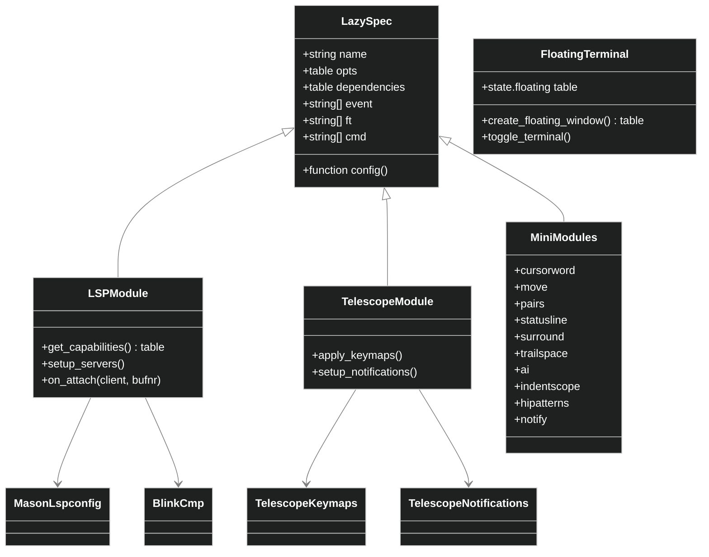
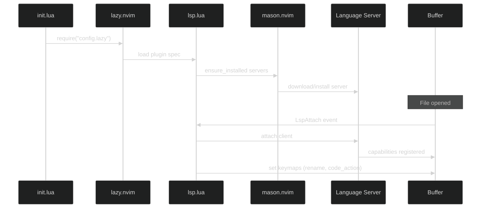
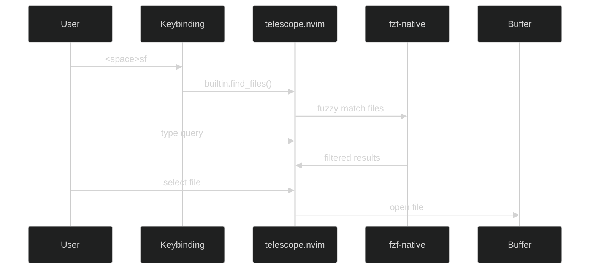
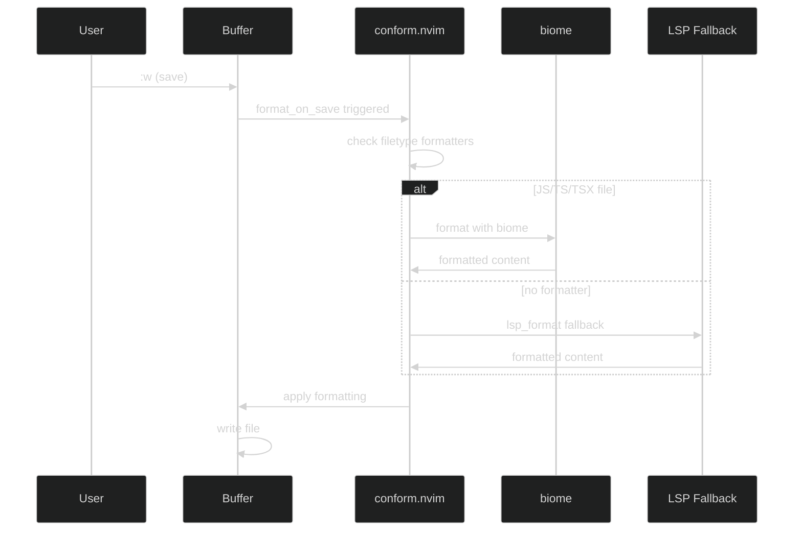

# Neovim Configuration Repository Analysis

## 1. Repository Overview

### High-Level Summary
Personal Neovim IDE configuration tailored for modern web development (TypeScript/JavaScript) with comprehensive multi-language support. Emphasizes:
- Seamless LSP integration and code completion
- Advanced TreeSitter-based syntax highlighting
- Keyboard-centric navigation via Telescope
- Aesthetic dark theme (Tokyo Night)

### Primary Technologies
- **Lua** - Exclusive configuration language
- **Lazy.nvim** - Modern plugin manager with lazy loading

### Supported Languages
TypeScript, JavaScript, CSS, SCSS, HTML, Lua, Python, Ruby, Go, Rust, Kotlin, Java, PHP, C, C++, JSON, GraphQL, Markdown, YAML, XML, Vue, Svelte, Bash, Docker, Nginx, SQL, and more.

### Key Dependencies (37 plugins)

| Category | Plugins |
|----------|---------|
| LSP | mason, nvim-lspconfig, typescript-tools |
| Completion | blink.cmp, blink-emoji |
| Navigation | telescope, oil.nvim, outline.nvim |
| Syntax | nvim-treesitter, nvim-ts-autotag |
| Formatting | conform.nvim (Biome, Stylua) |
| UI | tokyonight, mini.nvim suite |
| Utilities | which-key, undotree, zen-mode |

### Target Users
- TypeScript/JavaScript developers (primary)
- Full-stack developers
- Keyboard-centric power users
- Terminal-based IDE seekers

---

## 2. Project Structure Analysis

```
~/.config/nvim/
├── init.lua                    # Entry point - loads core modules
├── .editorconfig              # Editor standards (2-space, UTF-8, LF)
├── lazy-lock.json             # Plugin version lock (37 plugins)
├── lua/config/
│   ├── lazy.lua               # Plugin manager bootstrap
│   ├── options.lua            # Vim settings
│   ├── keymaps.lua            # Global keybindings
│   ├── highlight-yank.lua     # Yank visual feedback
│   ├── plugins/               # 22 plugin configurations
│   │   ├── lsp.lua            # Mason + LSP servers
│   │   ├── completion.lua     # Blink.cmp
│   │   ├── treesitter.lua     # Syntax highlighting
│   │   ├── typescript-tools.lua
│   │   ├── telescope.lua      # Fuzzy finder
│   │   ├── formatting.lua     # Conform.nvim
│   │   ├── theme.lua          # Tokyo Night
│   │   ├── mini.lua           # Mini.nvim suite
│   │   ├── file-tree.lua      # Oil.nvim
│   │   └── ...
│   └── telescope/
│       ├── keymaps.lua        # Telescope bindings
│       └── notifications.lua  # Custom notification picker
└── plugin/
    └── floaterminal.lua       # Custom floating terminal
```

### Configuration Files
- **init.lua** - Bootstrap sequence orchestrator
- **lazy-lock.json** - Deterministic plugin versions
- **.editorconfig** - LF endings, 2-space indent, UTF-8

### Entry Points
- **init.lua** - Main entry, loads lazy → keymaps → options → highlight-yank

---

## 3. High-Level Architecture Diagram

```mermaid
%%{init: {'theme': 'dark', 'themeVariables': { 'primaryColor': '#3d3d3d', 'primaryTextColor': '#fff', 'primaryBorderColor': '#6b6b6b', 'lineColor': '#808080', 'secondaryColor': '#2d2d2d', 'tertiaryColor': '#1a1a1a'}}}%%
flowchart TB
    subgraph Entry["Entry Layer"]
        init["init.lua"]
    end

    subgraph Core["Core Configuration"]
        lazy["lazy.lua<br/>Plugin Manager"]
        options["options.lua<br/>Editor Settings"]
        keymaps["keymaps.lua<br/>Global Bindings"]
        yank["highlight-yank.lua"]
    end

    subgraph Plugins["Plugin Layer"]
        subgraph LSP["LSP & Completion"]
            lsp["lsp.lua"]
            completion["completion.lua"]
            ts_tools["typescript-tools.lua"]
        end

        subgraph Syntax["Syntax & Formatting"]
            treesitter["treesitter.lua"]
            formatting["formatting.lua"]
            autotag["ts-autotag.lua"]
        end

        subgraph Navigation["Navigation & Search"]
            telescope["telescope.lua"]
            oil["file-tree.lua"]
            outline["outline.lua"]
        end

        subgraph UI["UI & UX"]
            theme["theme.lua"]
            mini["mini.lua"]
            whichkey["which-key.lua"]
        end
    end

    subgraph External["External Dependencies"]
        mason["Mason<br/>LSP Installer"]
        biome["Biome<br/>Formatter"]
        tmux["Tmux"]
    end

    init --> lazy
    init --> keymaps
    init --> options
    init --> yank

    lazy --> Plugins

    lsp --> mason
    lsp --> completion
    ts_tools --> lsp
    formatting --> biome

    telescope --> Navigation
    mini --> UI

    style Entry fill:#1a1a1a,stroke:#6b6b6b
    style Core fill:#2d2d2d,stroke:#6b6b6b
    style Plugins fill:#3d3d3d,stroke:#6b6b6b
    style External fill:#1a1a1a,stroke:#6b6b6b
```



---

## 4. Module/Component Analysis

### Core Modules

#### lazy.lua - Plugin Manager Bootstrap
- **Purpose**: Initialize lazy.nvim, set leader keys
- **API**: Auto-loads all specs from `config.plugins`
- **Pattern**: Bootstrap with auto-clone from GitHub

#### options.lua - Editor Configuration
- **Purpose**: Global Neovim settings
- **Settings**: 2-space indent, relative numbers, column 80, clipboard sync, persistent undo

#### keymaps.lua - Global Keybindings
- **Purpose**: Core navigation and LSP bindings
- **Key bindings**: `K` hover, `[d`/`]d` diagnostics, `<space>tih` inlay hints

### Plugin Modules

#### lsp.lua - Language Server Configuration
- **Purpose**: Mason setup, LSP capabilities, server configs
- **Servers**: lua_ls, tailwindcss, biome, clangd, vimls, marksman
- **API**: `get_capabilities()` - UTF-16 LSP capabilities
- **Dependencies**: mason, mason-lspconfig, blink.cmp

#### completion.lua - Code Completion
- **Purpose**: Blink.cmp engine with emoji support
- **Config**: LSP source, cmdline enabled, disabled in Telescope
- **Dependencies**: blink.cmp, blink-emoji

#### treesitter.lua - Syntax & Text Objects
- **Purpose**: TreeSitter highlighting for 50+ languages
- **Config**: auto_install disabled, vim regex disabled
- **Dependencies**: treesitter-textobjects, treesitter-context

#### typescript-tools.lua - TypeScript Support
- **Purpose**: Enhanced TS/JS LSP with inlay hints
- **Performance**: Separate diagnostic server, 12GB memory limit
- **Dependencies**: plenary, nvim-lspconfig, twoslash-queries

#### formatting.lua - Code Formatter
- **Purpose**: Conform.nvim with format-on-save
- **Formatters**: Biome (JS/TS), Stylua (Lua), Clang-format (C/C++)
- **Config**: LSP fallback, 1s timeout, async disabled

#### mini.lua - Utility Suite
- **Components**: cursorword, move, pairs, statusline, surround, trailspace, ai, indentscope, hipatterns, notify
- **Pattern**: Unified config for modular plugins

#### telescope.lua - Fuzzy Finder
- **Purpose**: File/content search with FZF
- **Extensions**: fzf-native, live-grep-args
- **Config**: Ivy theme, 25 picker cache

---

## 5. Interface/Abstraction Hierarchy



---

## 6. Data Flow and Sequence Diagrams

### LSP Initialization Flow



### File Navigation Flow



### Format on Save Flow



---

## 7. Module Interaction Map

```mermaid
%%{init: {'theme': 'dark', 'themeVariables': { 'primaryColor': '#3d3d3d', 'primaryTextColor': '#fff', 'primaryBorderColor': '#6b6b6b', 'lineColor': '#808080', 'secondaryColor': '#2d2d2d', 'tertiaryColor': '#1a1a1a'}}}%%
flowchart LR
    subgraph CoreConfig["Core Config"]
        init["init.lua"]
        lazy["lazy.lua"]
        opts["options.lua"]
        keys["keymaps.lua"]
    end

    subgraph LSPCluster["LSP Cluster"]
        lsp["lsp.lua"]
        mason["mason"]
        tst["typescript-tools"]
        comp["completion"]
    end

    subgraph SearchCluster["Search Cluster"]
        tele["telescope"]
        telekeys["telescope/keymaps"]
        telenoti["telescope/notifications"]
    end

    subgraph SyntaxCluster["Syntax Cluster"]
        ts["treesitter"]
        tag["ts-autotag"]
        comment["Comment.nvim"]
        fmt["formatting"]
    end

    subgraph UICluster["UI Cluster"]
        mini["mini.nvim"]
        theme["tokyonight"]
        wk["which-key"]
    end

    subgraph NavCluster["Navigation"]
        oil["oil.nvim"]
        outline["outline"]
        tmux["tmux-navigator"]
    end

    init --> lazy
    lazy --> LSPCluster
    lazy --> SearchCluster
    lazy --> SyntaxCluster
    lazy --> UICluster
    lazy --> NavCluster

    lsp <--> comp
    lsp --> mason
    tst --> lsp

    tele --> telekeys
    tele --> telenoti
    telenoti --> mini

    ts --> tag
    ts --> comment

    style CoreConfig fill:#1a1a1a,stroke:#6b6b6b
    style LSPCluster fill:#2d2d2d,stroke:#6b6b6b
    style SearchCluster fill:#2d2d2d,stroke:#6b6b6b
    style SyntaxCluster fill:#2d2d2d,stroke:#6b6b6b
    style UICluster fill:#2d2d2d,stroke:#6b6b6b
    style NavCluster fill:#2d2d2d,stroke:#6b6b6b
```



---

## 8. Key Algorithms and Business Logic

### Floating Terminal State Management
**Location**: `plugin/floaterminal.lua`

```lua
-- State object persists across toggles
state.floating = { buf = -1, win = -1 }

-- Window positioning algorithm
local width = math.floor(vim.o.columns * 0.8)
local height = math.floor(vim.o.lines * 0.8)
local col = math.floor((vim.o.columns - width) / 2)
local row = math.floor((vim.o.lines - height) / 2)
```
- Reuses buffer on toggle (validates with `nvim_buf_is_valid`)
- Centered window at 80% viewport size

### LSP Client Detection for Linting
**Location**: `lua/config/plugins/lsp.lua`

```lua
-- Detects eslint/biome presence before fix
for _, c in ipairs(vim.lsp.get_clients({ bufnr = 0 })) do
    if c.name == "eslint" then -- check for EslintFixAll
    elseif c.name == "biome" then -- warn biome unsupported
    end
end
```
- Graceful degradation with user notifications

### Custom Telescope Notification Picker
**Location**: `lua/config/telescope/notifications.lua`

- Fetches from `mini.notify.get_all()`
- Custom entry maker with formatted preview
- Text wrapping algorithm for long messages

### TypeScript Performance Optimizations
**Location**: `lua/config/plugins/typescript-tools.lua`

```lua
separate_diagnostic_server = true    -- Offload diagnostics
publish_diagnostic_on = "insert_leave"  -- Defer until leaving insert
tsserver_max_memory = 12288          -- 12GB limit
code_lens = "off"                    -- Disable expensive feature
```

### Smart Keybindings
**Location**: `lua/config/keymaps.lua`

```lua
-- Center view on search navigation
vim.keymap.set("n", "n", "nzzzv")
vim.keymap.set("n", "N", "Nzzzv")

-- Preserve cursor on line join
vim.keymap.set("n", "J", "mzJ`z")
```

---

## 9. Design Patterns

| Pattern | Implementation |
|---------|----------------|
| **Lazy Loading** | All plugins via lazy.nvim with event/ft triggers |
| **Module Export** | Functions exported via `M.apply_keymaps()` pattern |
| **Declarative Config** | Plugins configured via `opts` tables |
| **Bootstrap** | lazy.lua auto-clones package manager |
| **State Management** | Floating terminal maintains state object |
| **Capability Aggregation** | LSP centralizes capability configuration |
| **Event-Driven** | Autocommands for yank highlight, indent scope |
| **Per-Filetype Override** | Formatting and autotag customize per language |

---

## 10. Potential Architectural Improvements

1. **Modularize LSP configs** - Split language-specific LSP settings into separate files
2. **Extract keymap definitions** - Consolidate all keymaps in one place for easier discovery
3. **Add lazy-loading events** - More aggressive lazy loading for faster startup
4. **TypeScript tools fallback** - Graceful degradation when TS server unavailable
5. **Plugin health checks** - Add checkhealth integration for dependency validation
6. **Documentation generation** - Auto-generate keymap cheatsheet from code

---

## Quick Reference

### Leader Keys
- `<space>` - Primary leader
- `\` - Local leader

### Essential Keybindings

| Key | Action |
|-----|--------|
| `<space>sf` | Find files |
| `<space>sg` | Live grep |
| `<space>sr` | Resume picker |
| `<space>lf` | Format |
| `<space>lr` | Rename |
| `<space>la` | Code action |
| `<space>tih` | Toggle inlay hints |
| `<leader>tt` | Toggle terminal |
| `<F1>` | File tree |
| `<F2>` | Outline |
| `<F3>` | Undo tree |
| `gd` | Go to definition |
| `gr` | Go to references |
| `K` | Hover docs |

---

*Generated by Claude Code analysis*
